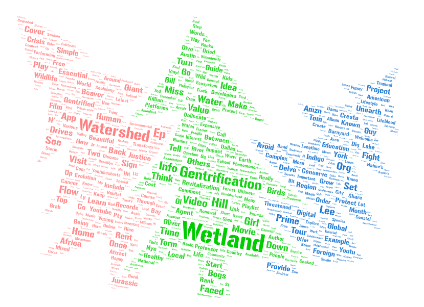

# lab02-web-data
## i. The topic I chose was focused on "watersheds" since I am familiar with them, since I did my final project in GEOG 360 on it. The parameters I used were "watersheds" "wetlands" & "gentrification."
## ii. I made this comparison to capture the key terms used by users that are interested in this topic, as well as spread awareness to the phenomenon.
## iii. The first word cloud focuses on place-based environmental and social implications, specifically wetlands, gentrification, and local community experience. The second turns the focus to institutional power and public discourse, emphasizing protest, media, and federal authority. They show how environmental problems are experienced locally and debated nationally through political and media institutions.
## iv. Differences in scale, authorship, and media framing are most likely to account for the trends seen. Place-based perspectives focus on environmental systems and lived experience, whereas national discourse stresses political struggle, institutions, and media prominence. Together, the word clouds show how environmental challenges are transferred from local landscapes to national arenas of power.
## v. Future versions of this study might benefit from more diverse and balanced source selection, time separation, and complementing qualitative and geographical approaches, which would allow speech patterns to be understood with greater complexity and regional specificity.
## vi. One surprising result of this study was how focused the discussion got on a small number of prominent phrases, especially when the scale went from local to national. Environmental language proved more fragile than expected, being absorbed by institutional and media-focused slang. Furthermore, the simultaneous use of gentrification and environmental words called into question beliefs that ecological and housing concerns are conceptually distinct, emphasizing the mutual reliance of social and environmental processes.

## Word Clouds
### Word Cloud 1

### Word Cloud 2

## Download Collected Data

The gathered data via search results can be downloaded here:

- [download videos.csv](https://raw.githubusercontent.com/ryvcon/lab02-web-data/refs/heads/main/assets/videos.csv)
- [download videos2.csv](https://raw.githubusercontent.com/ryvcon/lab02-web-data/refs/heads/main/assets/videos_2.csv)
